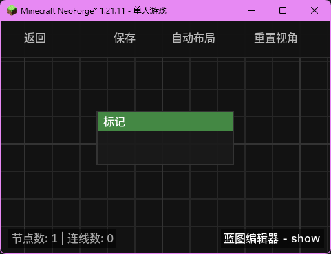

# 标记 (Marker)

**标记** 节点是一个纯注释性质的特殊节点，用于在蓝图中添加说明文字、组织逻辑块或记录开发笔记。它不会对程序的运行逻辑产生任何影响。

## 节点概览
- **分类**: 特殊
- **内部ID**：`mgmc:marker`
- 

## 端口定义

### 输入 (Inputs)
| 端口名称 | 类型 | 说明 |
| :--- | :--- | :--- |
| **备注** (Comment) | 字符串 (String) | 在节点上显示的说明文字。支持多行输入。 |