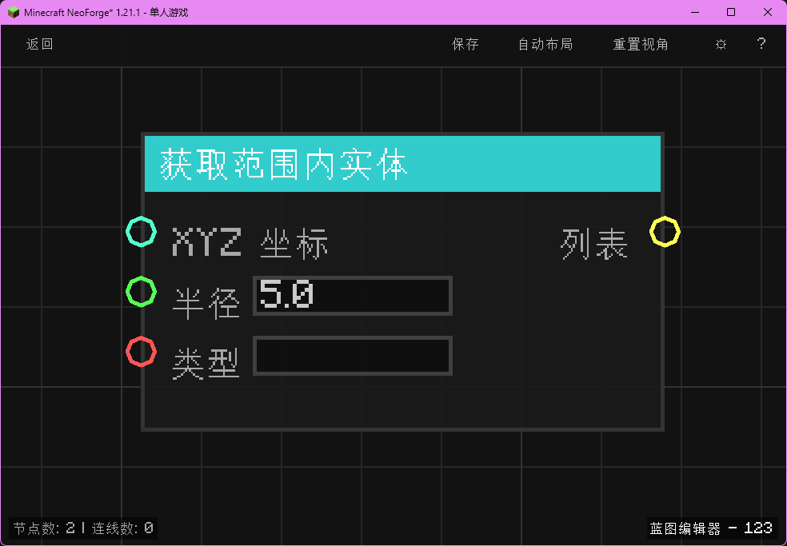

# 获取范围内实体 (Get Entities in Range)
获取指定坐标周围一定半径内的实体列表。

## 节点概览
- **分类**：变量 > 实体
- **内部ID**：`mgmc:get_entities_in_range`
- **预览图**：
  

## 端口定义表格

### 输入 (Inputs)
| 端口名称 | 类型 | 说明 |
| :--- | :--- | :--- |
| **XYZ 坐标** (XYZ Position) | XYZ | 中心点坐标。默认为 (0,0,0)。 |
| **半径** (Radius) | 浮点数 (Float) | 搜索半径。默认 5.0。 |
| **类型** (Type) | 字符串 (String) | 实体类型过滤（例如 "minecraft:zombie"）。留空则匹配所有。 |

### 输出 (Outputs)
| 端口名称 | 类型 | 说明 |
| :--- | :--- | :--- |
| **列表** (List) | 列表 (List) | 匹配的实体对象列表。 |

## 行为说明
1. 节点执行时，以输入的 **XYZ 坐标** 为中心，构建一个边长为 `2 * 半径` 的轴对齐包围盒 (AABB)。
2. 如果 **XYZ 坐标** 输入未连接或为 null，则默认为 (0,0,0)。
3. 如果 **半径** <= 0，则默认为 5.0。
4. 如果提供了 **类型** 字符串，会检查实体的注册名（Registry Name）。
   - 支持完整 ID，如 `minecraft:zombie`。
   - 支持省略命名空间，如 `zombie`（会自动匹配 `minecraft:zombie`）。
   - 如果字符串为空，则匹配所有类型的实体。
5. 返回找到的实体对象列表。如果未找到任何实体或所在 Level 为空，返回空列表。
