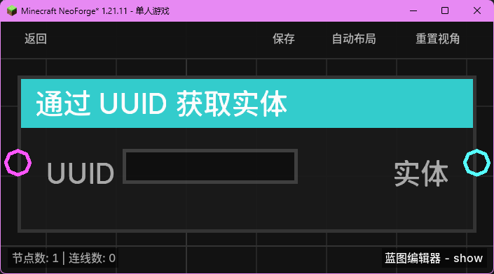

# 通过 UUID 获取实体 (Get Entity by UUID)

**通过 UUID 获取实体** 节点用于根据实体的唯一标识符（UUID）在当前服务器加载的世界中查找并返回该实体对象。

## 节点概览
- **分类**: 变量 > 实体
- **内部ID**：`mgmc:get_entity_by_uuid`
- 

## 端口定义

### 输入 (Inputs)
| 端口名称 | 类型 | 说明 |
| :--- | :--- | :--- |
| **UUID** (UUID) | UUID | 实体的唯一标识符字符串。 |

### 输出 (Outputs)
| 端口名称 | 类型 | 说明 |
| :--- | :--- | :--- |
| **实体** (Entity) | 实体 (Entity) | 查找到的实体对象。如果未找到或 UUID 格式错误，则返回 `null`。 |

## 行为说明
1. **实体查找**：节点会调用内部的查找逻辑，在服务器所有已加载的维度中搜索具有指定 UUID 的实体。
2. **纯值处理**：这是一个纯值获取节点，不包含执行流。只要输出端口被引用，它就会执行一次查找逻辑。
3. **用途**：当你只持有实体的 UUID 字符串（例如从配置文件读取或从之前的逻辑中保存），但需要将其作为“实体”类型输入到其他节点（如“传送实体”）时，使用此节点进行转换。
4. **性能说明**：由于 UUID 查找涉及全局搜索，虽然通常很快，但仍建议在逻辑允许的情况下缓存获取到的实体引用，避免在每一刻都重复查找。
