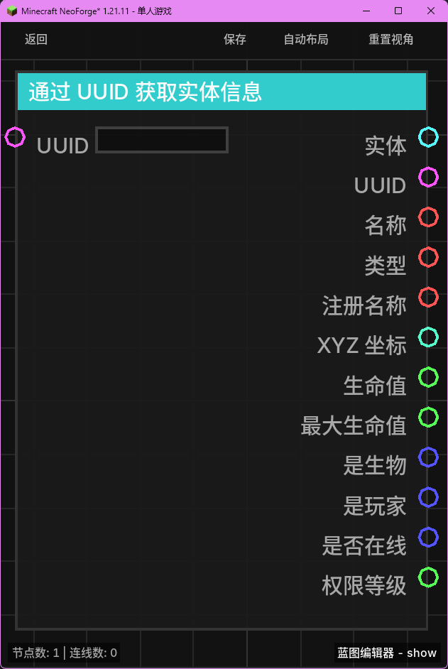

# 通过 UUID 获取实体信息 (Get Entity Info by UUID)

**通过 UUID 获取实体信息** 节点允许你根据实体的唯一标识符（UUID）在世界中查找该实体，并提取其各项详细属性，如名称、坐标、生命值等。

## 节点概览
- **分类**: 变量 > 实体
- **内部ID**：`mgmc:get_entity_info_byuuid`
- 

## 端口定义

### 输入 (Inputs)
| 端口名称 | 类型 | 说明 |
| :--- | :--- | :--- |
| **UUID** (UUID) | UUID | 实体的唯一标识符字符串。 |

### 输出 (Outputs)
| 端口名称 | 类型 | 说明 |
| :--- | :--- | :--- |
| **实体** (Entity) | 实体 (Entity) | 查找到的实体对象。如果未找到则返回 `null`。 |
| **UUID** (UUID) | UUID | 该实体的 UUID 字符串。 |
| **名称** (Name) | 字符串 (String) | 实体的显示名称（如玩家名或生物自定义名）。 |
| **类型** (Type) | 字符串 (String) | 实体的类型名称。 |
| **注册名称** (Registry Name) | 字符串 (String) | 实体的注册 ID（如 `minecraft:zombie`）。 |
| **XYZ 坐标** (XYZ) | XYZ | 实体当前所在的位置坐标。 |
| **生命值** (Health) | 浮点数 (Float) | 实体当前的生命值。非生物实体可能返回 `0`。 |
| **最大生命值** (Max Health) | 浮点数 (Float) | 实体的最大生命值上限。 |
| **是生物** (Is Living) | 布尔值 (Boolean) | 实体是否为生物（LivingEntity）。 |
| **是玩家** (Is Player) | 布尔值 (Boolean) | 实体是否为玩家。 |
| **是否在线** (Is Online) | 布尔值 (Boolean) | 如果是玩家，该玩家当前是否在线。 |
| **权限等级** (Permission Level) | 浮点数 (Float) | 如果是玩家，其当前的 OP 权限等级（0-4）。 |

## 行为说明
1. **实体查找**：节点会尝试在当前服务器加载的所有维度中查找匹配该 UUID 的实体。
2. **纯值处理**：这是一个纯值获取节点，不包含执行流。只要任何一个输出端口被引用，它就会执行一次查找逻辑并返回结果。
3. **安全性**：如果 UUID 格式错误或找不到对应的实体，所有输出端口都将返回其类型的默认值（如数值返回 `0`，对象返回 `null`）。
4. **性能建议**：由于 UUID 查找涉及全局搜索，建议避免在每一刻都频繁调用此节点，除非确有必要。
