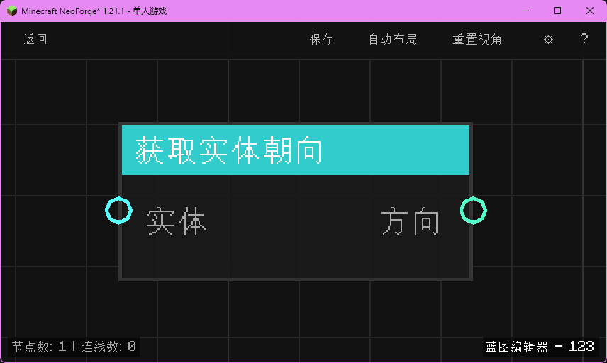

# 获取实体朝向 (Get Entity Look Direction)
获取指定实体的视线方向向量（XYZ）。

## 节点概览
- **分类**：变量 > 实体
- **内部ID**：`mgmc:get_entity_look_direction`
- **预览图**：
  

## 端口定义表格

### 输入 (Inputs)
| 端口名称 | 类型 | 说明 |
| :--- | :--- | :--- |
| **实体** (Entity) | 实体 (Entity) | 目标实体。 |

### 输出 (Outputs)
| 端口名称 | 类型 | 说明 |
| :--- | :--- | :--- |
| **方向** (Direction) | XYZ | 实体的视线方向单位向量。例如玩家看向正上方时为 (0, 1, 0)。如果实体无效，返回 (0, 0, 0)。 |

## 行为说明
1. 获取输入实体的视线向量 (`Look Angle`)。
2. 该向量是归一化的单位向量，表示实体眼睛朝向的方向。
3. 可以将此输出连接到“射线检测”节点的“方向”端口，用于检测玩家视线所指的目标。
