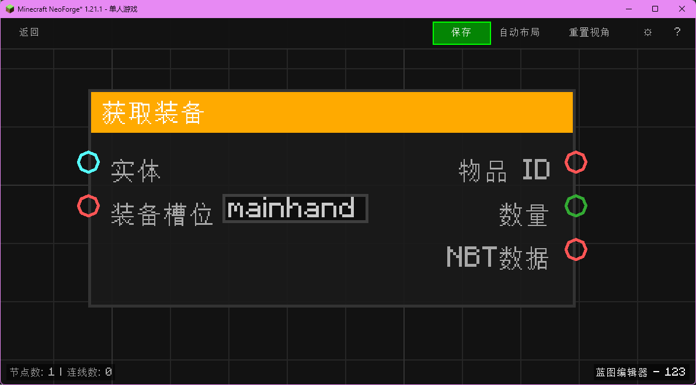

# 获取装备 (Get Equipment)

获取实体指定槽位的物品信息。

## 节点概览
- **分类**: 变量 > 实体
- **内部ID**：`mgmc:get_equipment`
- 

## 端口定义

### 输入 (Inputs)
| 端口名称 | 类型 | 说明 |
| :--- | :--- | :--- |
| **实体** (Entity) | 实体 (Entity) | 目标实体。 |
| **装备槽位** (Slot) | 字符串 (String) | 槽位名称：`mainhand`, `offhand`, `feet`, `legs`, `chest`, `head`。 |

### 输出 (Outputs)
| 端口名称 | 类型 | 说明 |
| :--- | :--- | :--- |
| **物品 ID** (Item ID) | 字符串 (String) | 物品的注册 ID（如 `minecraft:diamond_sword`）。 |
| **数量** (Count) | 整数 (Integer) | 堆叠数量。 |
| **NBT数据** (NBT) | 字符串 (String) | 物品的 NBT 数据（Tag）。 |

## 行为说明
1. **主要行为**：读取实体特定装备槽中的物品堆栈。
2. **特殊情况**：如果槽位为空，返回 `minecraft:air`，数量为 0。
