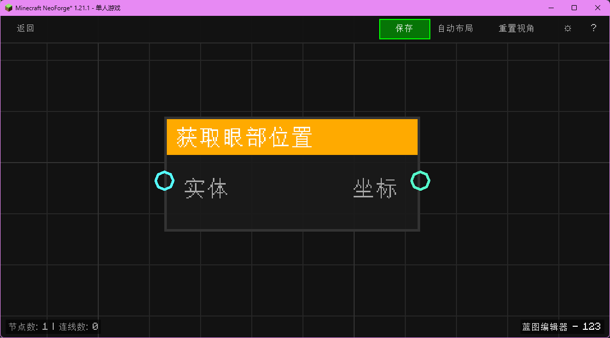

# 获取眼部位置 (Get Eye Position)

获取实体的眼部坐标位置。

## 节点概览
- **分类**: 变量 > 实体
- **内部ID**：`mgmc:get_eye_position`
- 

## 端口定义

### 输入 (Inputs)
| 端口名称 | 类型 | 说明 |
| :--- | :--- | :--- |
| **实体** (entity) | 实体 (Entity) | 目标实体。 |

### 输出 (Outputs)
| 端口名称 | 类型 | 说明 |
| :--- | :--- | :--- |
| **坐标** (xyz) | XYZ坐标 (XYZ) | 眼部坐标 (x, y, z)。 |

## 行为说明
1. **主要行为**：获取输入实体的眼部坐标（Eye Position）。
2. **特殊情况**：如果输入的实体为空 (`null`)，则返回零向量 `(0, 0, 0)`。
3. **注意事项**：对于玩家，眼部坐标通常比脚部坐标高 1.62 格。使用此坐标作为射线检测的起点可以获得更符合视觉预期的结果。
