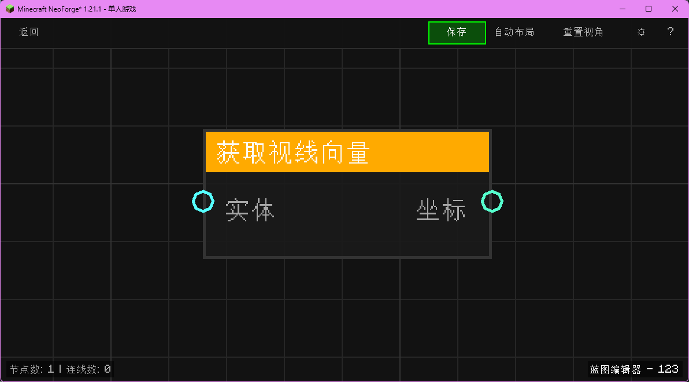

# 获取视线向量 (Get Look Vector)

获取实体的视线方向向量。

## 节点概览
- **分类**: 变量 > 实体
- **内部ID**：`mgmc:get_look_vector`
- 

## 端口定义

### 输入 (Inputs)
| 端口名称 | 类型 | 说明 |
| :--- | :--- | :--- |
| **实体** (entity) | 实体 (Entity) | 目标实体。 |

### 输出 (Outputs)
| 端口名称 | 类型 | 说明 |
| :--- | :--- | :--- |
| **坐标** (xyz) | XYZ坐标 (XYZ) | 视线方向向量 (归一化)。 |

## 行为说明
1. **主要行为**：获取输入实体的视线向量（Look Angle）。
2. **特殊情况**：如果输入的实体为空 (`null`)，则返回零向量 `(0, 0, 0)`。
3. **注意事项**：返回的向量是归一化的单位向量，长度为 1，可直接用于射线检测的方向输入。
