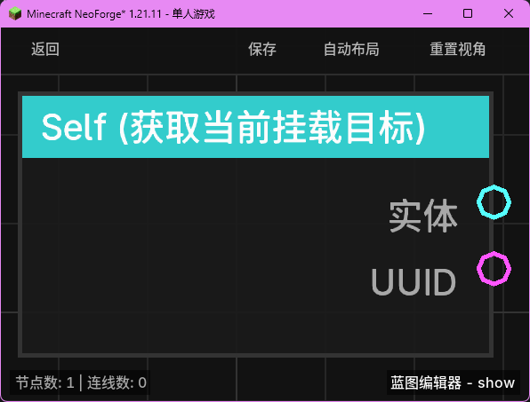

# Self (获取当前挂载目标)

**Self** 节点用于获取当前蓝图执行上下文中所关联的“触发实体”。

## 节点概览
- **分类**: 变量 > 实体
- **内部ID**：`mgmc:self`
- 

## 端口定义

### 输出 (Outputs)
| 端口名称 | 类型 | 说明 |
| :--- | :--- | :--- |
| **实体** (Entity) | 实体 (Entity) | 当前蓝图触发的实体对象。 |
| **UUID** (UUID) | UUID | 触发实体的唯一标识符字符串。 |

## 行为说明
1. **获取触发者**：该节点从执行上下文（Context）中提取 `triggerEntity`。
2. **上下文依赖**：
   - 如果蓝图是由某个实体（如玩家右键、生物受伤）触发的，该节点将返回该实体。
   - 如果蓝图是在没有实体关联的情况下触发的（如全局定时器、服务器启动），则该节点将返回 `null`。
3. **用途**：这是编写“针对触发者”逻辑的核心节点。例如，在“实体受伤”事件中，使用此节点可以获取到受伤的实体，进而对其进行治疗或传送。
