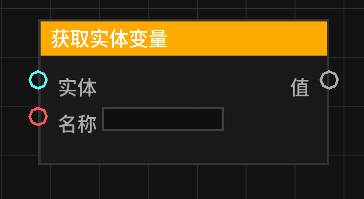

# 获取实体变量 (get_entity_variable)

从指定实体上获取存储的变量值。

## 节点概览
- **分类**: 变量
- **内部ID**：`mgmc:get_entity_variable`
- 

## 端口定义

### 输入 (Inputs)
| 端口名称 | 类型 | 说明 |
| :--- | :--- | :--- |
| **实体** (entity) | 实体 (Entity) | 要从中获取变量的实体。支持传入实体对象或 UUID。 |
| **名称** (name) | 字符串 (String) | 要获取的变量名称。 |

### 输出 (Outputs)
| 端口名称 | 类型 | 说明 |
| :--- | :--- | :--- |
| **值** (value) | 任意 (Any) | 存储在该实体上的变量值。如果实体不存在、变量名无效或管理器未就绪，则输出 `null`。 |

## 行为说明
1. **实体绑定**：该节点允许将数据“挂载”到特定的实体（如玩家、猪、僵尸等）上。
2. **获取逻辑**：节点首先解析输入的“实体”，获取其 UUID，然后根据“名称”在实体的私有变量池中查找。
3. **UUID 兼容性**：如果输入的不是实体对象，节点会尝试将其转换为 UUID 字符串进行匹配。
4. **即时运算**：该节点为数据节点，不包含执行流，每次调用都会实时检索当前的存储值。
