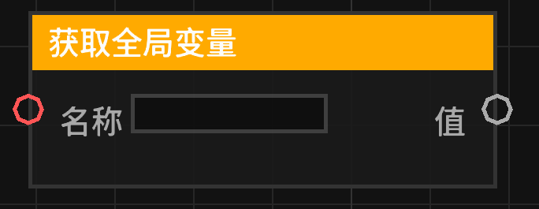

# 获取全局变量 (get_global_variable)

从全局变量管理器中获取指定名称的变量值。与普通变量不同，全局变量在整个服务器/存档生命周期内持续存在。

## 节点概览
- **分类**: 变量
- **内部ID**：`mgmc:get_global_variable`
- 

## 端口定义

### 输入 (Inputs)
| 端口名称 | 类型 | 说明 |
| :--- | :--- | :--- |
| **名称** (name) | 字符串 (String) | 要获取的全局变量名称。 |

### 输出 (Outputs)
| 端口名称 | 类型 | 说明 |
| :--- | :--- | :--- |
| **值** (value) | 任意 (Any) | 存储在指定名称下的全局变量值。如果变量不存在、名称为空或管理器未就绪，则输出 `null`。 |

## 行为说明
1. **全局持久性**：全局变量存储在 `GlobalVariableManager` 中，通常跨蓝图执行上下文共享，并可能随存档保存。
2. **获取逻辑**：节点会读取输入的“名称”，去除首尾空格后进行查找。
3. **空值处理**：如果名称为空或管理器不可用，将返回 `null`。
4. **即时运算**：该节点为数据节点，实时获取当前最新的全局值。
