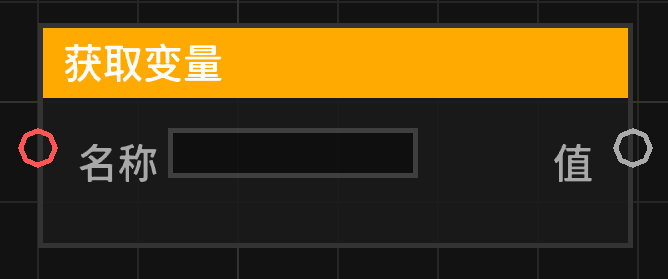

# 获取变量 (get_variable)

根据变量名称从当前上下文中获取存储的变量值。

## 节点概览
- **分类**: 变量
- **内部ID**：`mgmc:get_variable`
- 

## 端口定义

### 输入 (Inputs)
| 端口名称 | 类型 | 说明 |
| :--- | :--- | :--- |
| **名称** (name) | 字符串 (String) | 要获取的变量名称。 |

### 输出 (Outputs)
| 端口名称 | 类型 | 说明 |
| :--- | :--- | :--- |
| **值** (value) | 任意 (Any) | 存储在指定名称下的变量值。如果变量不存在或名称为空，则输出 `null`。 |

## 行为说明
1. **获取逻辑**：节点会读取输入的“名称”，去除首尾空格后，从当前蓝图执行上下文（Context）的变量池中查找。
2. **空值处理**：如果名称为空字符串或仅包含空格，将直接返回 `null`。
3. **动态类型**：输出端口为“任意”类型，可以连接到任何类型的输入端口，但在使用时可能需要进行类型转换。
4. **即时运算**：该节点属于数据节点，不包含执行流。
