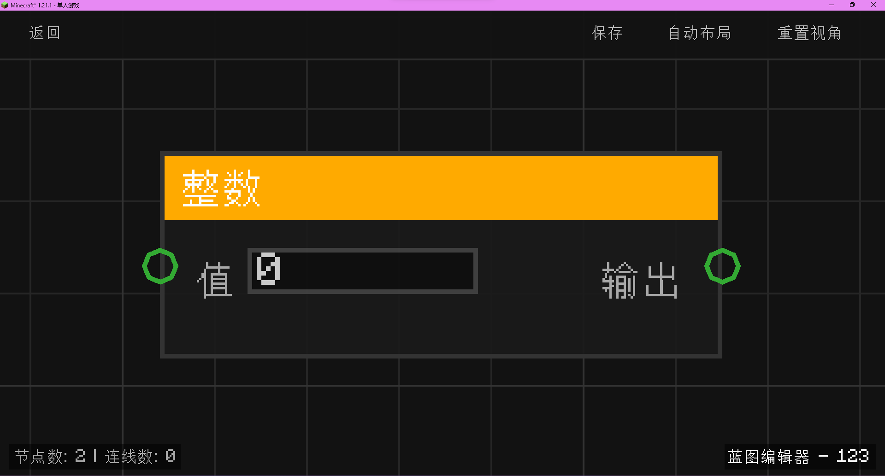

# 整数 (int)

提供一个可配置的常数整数值。

## 节点概览
- **分类**: 变量
- **内部ID**：`mgmc:int`
- 

## 端口定义

### 输入 (Inputs)
| 端口名称 | 类型 | 说明 |
| :--- | :--- | :--- |
| **值** (value) | 整数 (Int) | 在编辑器中输入的整数值。 |

### 输出 (Outputs)
| 端口名称 | 类型 | 说明 |
| :--- | :--- | :--- |
| **输出** (value) | 整数 (Int) | 输出输入的数值。 |

## 行为说明
1. **主要行为**：该节点主要用于在蓝图中提供一个固定的整数常量。
2. **默认值说明**：默认值为 `0`。
3. **即时运算**：该节点属于数据节点，其输出值始终等于输入端口设定的值。
