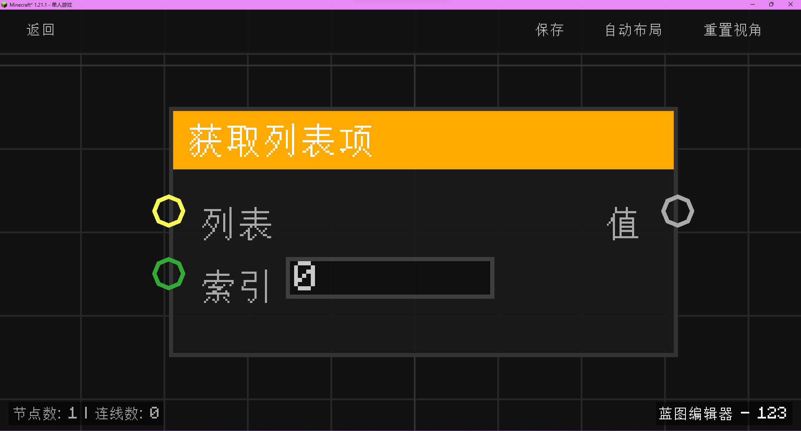

# 获取列表项 (Get List Item)

**获取列表项** 节点用于从指定的列表中根据索引提取特定的元素。

## 节点概览
- **分类**: 变量 > 列表
- **内部ID**：`mgmc:get_list_item`
- 

## 端口定义

### 输入 (Inputs)
| 端口名称 | 类型 | 说明 |
| :--- | :--- | :--- |
| **列表** (List) | 列表 (List) | 要从中提取项的目标列表。 |
| **索引** (Index) | 整数 (Int) | 目标项在列表中的位置（从 0 开始计数）。 |

### 输出 (Outputs)
| 端口名称 | 类型 | 说明 |
| :--- | :--- | :--- |
| **值** (Value) | 任意 (Any) | 提取到的列表项。如果索引超出范围或列表为空，则返回 `null`。 |

## 行为说明
1. **零基索引**：列表的第一个元素的索引为 `0`，第二个为 `1`，依此类推。
2. **安全检查**：
   - 如果输入的 `Index` 小于 0 或大于等于列表的长度，节点 will 返回 `null`。
   - 如果输入的 `List` 为空或无效，节点 will 返回 `null`。
3. **即时运算**：该节点属于数据节点，不包含执行流（Exec）。每当其输出端口被引用时，都会根据当前的输入列表和索引重新提取值。
