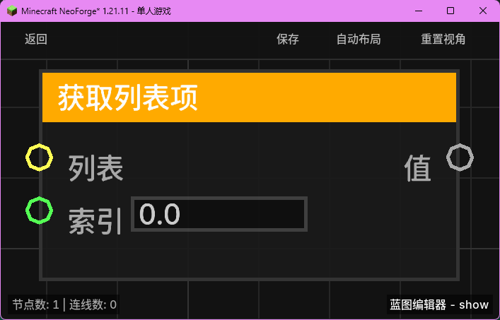

# 添加到列表 (List Add)

将一个元素添加到指定列表的末尾，并返回包含该元素的新列表。

## 节点概览
- **分类**: 变量 > 列表
- **内部ID**：`mgmc:list_add`
- 

## 端口定义

### 输入 (Inputs)
| 端口名称 | 类型 | 说明 |
| :--- | :--- | :--- |
| **列表** (List) | 列表 (List) | 要添加元素的原始列表。 |
| **值** (Value) | 任意 (Any) | 要添加到列表末尾的元素。 |

### 输出 (Outputs)
| 端口名称 | 类型 | 说明 |
| :--- | :--- | :--- |
| **列表** (List) | 列表 (List) | 添加元素后的新列表。 |

## 行为说明
1. **不可变性**：为了保证蓝图执行的安全，该节点不会直接修改原始列表，而是创建一个包含新元素的原始列表副本。
2. **末尾添加**：新元素始终会被添加到列表的最末尾。
3. **空值处理**：如果输入的列表为 `null`，节点将创建一个仅包含该“值”的新列表。
