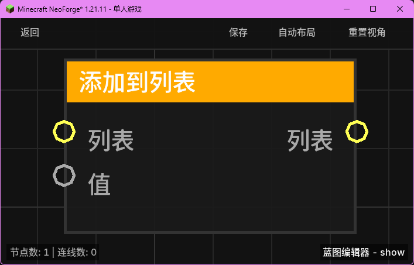

# 添加到列表 (List Add)

**添加到列表** 节点用于向现有列表中追加一个新元素，并返回更新后的列表。

## 节点概览
- **分类**: 变量 > 列表
- **内部ID**：`mgmc:list_add`
- 

## 端口定义

### 输入 (Inputs)
| 端口名称 | 类型 | 说明 |
| :--- | :--- | :--- |
| **列表** (List) | 列表 (List) | 要添加元素的目标列表。 |
| **值** (Value) | 任意 (Any) | 要添加到列表末尾的新元素。 |

### 输出 (Outputs)
| 端口名称 | 类型 | 说明 |
| :--- | :--- | :--- |
| **列表** (List) | 列表 (List) | 包含新添加元素后的新列表对象。 |

## 行为说明
1. **追加操作**：新元素将被添加到列表的末尾。
2. **不可变性处理**：该节点会创建一个原列表的副本（ArrayList），并在副本上进行添加操作，然后返回该副本。这确保了原始输入列表在某些引用场景下不会被意外修改。
3. **类型兼容**：由于“值”端口类型为 `Any`，你可以向列表中添加任何类型的数据（如字符串、数值、实体等）。
