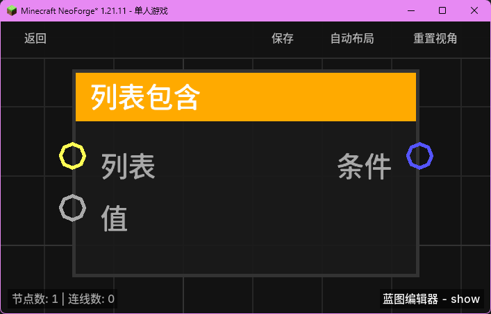

# 列表包含 (List Contains)

**列表包含** 节点用于检查指定的列表中是否包含某个特定的元素。

## 节点概览
- **分类**: 变量 > 列表
- **内部ID**：`mgmc:list_contains`
- 

## 端口定义

### 输入 (Inputs)
| 端口名称 | 类型 | 说明 |
| :--- | :--- | :--- |
| **列表** (List) | 列表 (List) | 要进行检索的目标列表。 |
| **值** (Value) | 任意 (Any) | 要在列表中查找的目标元素。 |

### 输出 (Outputs)
| 端口名称 | 类型 | 说明 |
| :--- | :--- | :--- |
| **条件** (Condition) | 布尔值 (Boolean) | 如果列表中包含该元素，则返回 `true`；否则返回 `false`。 |

## 行为说明
1. **多重比较逻辑**：为了提高匹配的成功率，该节点采用了多级比较机制：
   - **引用比较**：首先使用标准的 `List.contains()` 检查是否存在相同的对象引用。
   - **数值比较**：如果目标是数值类型，节点会遍历列表并进行数值大小比较（忽略具体数字类型差异，如 Integer 和 Double）。
   - **字符串比较**：作为最后的保底方案，节点会将目标和列表项都转换为字符串进行内容匹配。
2. **空值处理**：如果输入的 `List` 为空（null），节点将始终返回 `false`。
3. **用途**：常用于条件分支（Branch）节点前，判断某个实体、玩家或特定数据是否存在于某个集合中。
