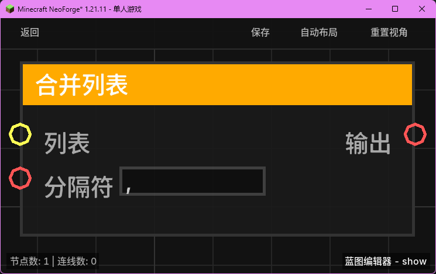

# 合并列表 (List Join)

**合并列表** 节点用于将列表中的所有元素转换为字符串，并使用指定的分隔符将它们连接在一起。

## 节点概览
- **分类**: 变量 > 列表
- **内部ID**：`mgmc:list_join`
- 

## 端口定义

### 输入 (Inputs)
| 端口名称 | 类型 | 说明 |
| :--- | :--- | :--- |
| **列表** (List) | 列表 (List) | 要进行合并操作的目标列表。 |
| **分隔符** (Delimiter) | 字符串 (String) | 用于连接列表项的字符（默认为 `,`）。 |

### 输出 (Outputs)
| 端口名称 | 类型 | 说明 |
| :--- | :--- | :--- |
| **输出** (Output) | 字符串 (String) | 合并后的完整字符串。 |

## 行为说明
1. **字符串转换**：节点会遍历列表中的每一个元素，并使用 `TypeConverter.toString` 将其转换为字符串。这意味着列表可以包含任何类型（如数字、UUID、实体名称等）。
2. **连接逻辑**：使用输入提供的 `Delimiter` 作为间隔，将所有转换后的字符串拼接起来。
3. **空值处理**：
   - 如果输入的 `List` 为空（null），节点将返回一个空字符串 `""`。
   - 如果 `Delimiter` 为空（null），则默认使用空字符串进行连接。
4. **用途**：常用于将多个数据（如玩家列表、坐标列表）格式化为一条可读的消息，并发送到聊天栏或记录到日志中。
