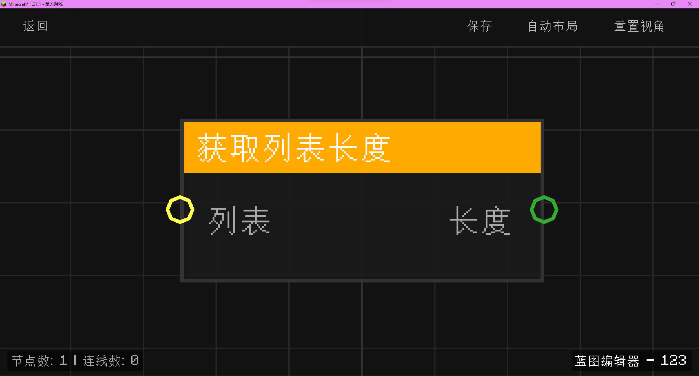

# 获取列表长度 (List Length)

**获取列表长度** 节点用于获取指定列表中的元素总数。

## 节点概览
- **分类**: 变量 > 列表
- **内部ID**：`mgmc:list_length`
- 

## 端口定义

### 输入 (Inputs)
| 端口名称 | 类型 | 说明 |
| :--- | :--- | :--- |
| **列表** (List) | 列表 (List) | 要测量长度的目标列表。 |

### 输出 (Outputs)
| 端口名称 | 类型 | 说明 |
| :--- | :--- | :--- |
| **长度** (Length) | 整数 (Int) | 列表中元素的总数量。 |

## 行为说明
1. **获取计数**：节点会返回输入列表中包含的所有元素数量。
2. **安全处理**：
   - 如果输入的 `List` 为空（null）或不是一个有效的列表，节点将返回 `0`。
   - 如果在处理过程中发生任何异常，节点同样会返回 `0` 作为兜底。
3. **数据类型**：该节点输出的是整数类型（Int）。
