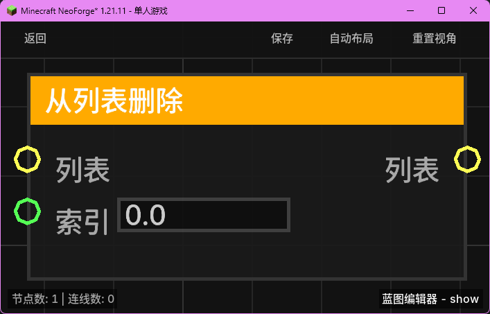

# 从列表删除 (List Remove)

**从列表删除** 节点用于根据指定的索引从现有列表中移除一个元素，并返回更新后的列表。

## 节点概览
- **分类**: 变量 > 列表
- **内部ID**：`mgmc:list_remove`
- 

## 端口定义

### 输入 (Inputs)
| 端口名称 | 类型 | 说明 |
| :--- | :--- | :--- |
| **列表** (List) | 列表 (List) | 要执行删除操作的目标列表。 |
| **索引** (Index) | 浮点数 (Float) | 要删除的项在列表中的位置（从 0 开始计数）。系统会自动将其转换为整数。 |

### 输出 (Outputs)
| 端口名称 | 类型 | 说明 |
| :--- | :--- | :--- |
| **列表** (List) | 列表 (List) | 移除指定元素后的新列表对象。 |

## 行为说明
1. **按索引删除**：该节点根据提供的索引值移除列表中的特定项。
2. **零基索引**：第一个元素的索引为 `0`。
3. **不可变性处理**：该节点会创建一个原列表的副本（ArrayList），并在副本上执行删除操作，然后返回该副本。这确保了原始输入列表不会被直接修改。
4. **越界检查**：
   - 如果提供的 `Index` 大于或等于列表长度，或者小于 0，则不会执行任何删除操作，直接返回原列表（副本）。
   - 如果输入的 `List` 为空或无效，将返回一个空列表。
