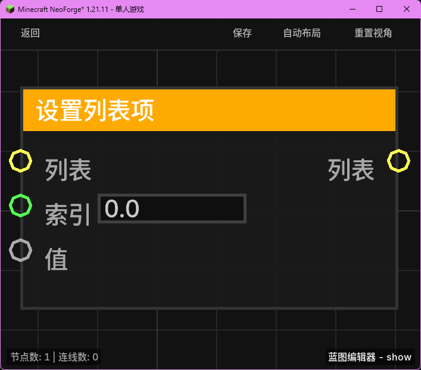

# 设置列表项 (List Set Item)

**设置列表项** 节点用于修改现有列表中指定索引处的元素，或在列表末尾追加新元素。

## 节点概览
- **分类**: 变量 > 列表
- **内部ID**：`mgmc:list_set_item`
- 

## 端口定义

### 输入 (Inputs)
| 端口名称 | 类型 | 说明 |
| :--- | :--- | :--- |
| **列表** (List) | 列表 (List) | 要修改的目标列表。 |
| **索引** (Index) | 浮点数 (Float) | 要设置的项在列表中的位置（从 0 开始计数）。系统会自动将其转换为整数。 |
| **值** (Value) | 任意 (Any) | 要设置的新元素内容。 |

### 输出 (Outputs)
| 端口名称 | 类型 | 说明 |
| :--- | :--- | :--- |
| **列表** (List) | 列表 (List) | 修改完成后的新列表对象。 |

## 行为说明
1. **替换操作**：如果 `Index` 位于现有列表范围内（0 到 列表长度-1），该索引处的元素将被 `Value` 替换。
2. **追加操作**：如果 `Index` 正好等于列表的长度，新元素将被追加到列表的末尾（相当于 Add 操作）。
3. **不可变性处理**：该节点会创建一个原列表的副本（ArrayList），并在副本上执行修改操作，然后返回该副本。这确保了原始输入列表不会被直接修改。
4. **越界检查**：如果 `Index` 小于 0 或大于列表长度，节点将不会执行任何操作，直接返回原列表（副本）。
