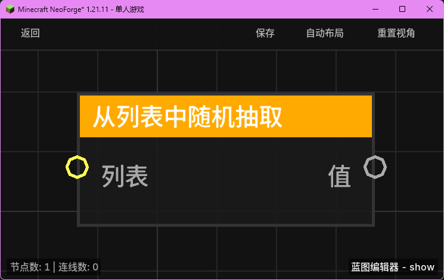

# 从列表中随机抽取 (Random List Item)

**从列表中随机抽取** 节点用于从指定的列表中随机选择并返回一个元素。

## 节点概览
- **分类**: 变量 > 列表
- **内部ID**：`mgmc:random_list_item`
- 

## 端口定义

### 输入 (Inputs)
| 端口名称 | 类型 | 说明 |
| :--- | :--- | :--- |
| **列表** (List) | 列表 (List) | 要从中抽取的源列表。 |

### 输出 (Outputs)
| 端口名称 | 类型 | 说明 |
| :--- | :--- | :--- |
| **值** (Value) | 任意 (Any) | 随机抽取到的元素。如果列表为空或无效，则返回 `null`。 |

## 行为说明
1. **等概率抽取**：节点使用内部随机数生成器（`Random`）从列表中等概率地选择一个索引。
2. **安全处理**：
   - 在抽取前会检查列表是否为 `null` 以及是否包含元素。
   - 如果列表为空或不是有效的列表对象，节点将安全地返回 `null`，避免抛出异常。
3. **用途**：常用于制作随机奖励、随机传送点、随机对话等需要不确定性的逻辑场景。
