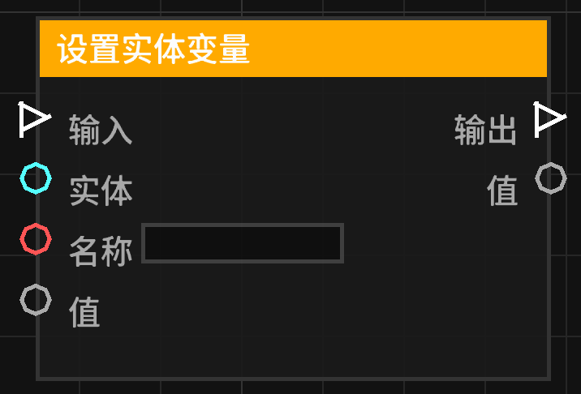

# 设置实体变量 (set_entity_variable)

在指定实体上存储一个变量值。

## 节点概览
- **分类**: 变量
- **内部ID**：`mgmc:set_entity_variable`
- 

## 端口定义

### 执行流 (Exec)
| 端口名称 | 类型 | 说明 |
| :--- | :--- | :--- |
| **执行输入** (exec_in) | 执行流 (Exec) | 激活该节点。 |
| **执行输出** (exec_out) | 执行流 (Exec) | 节点完成实体变量赋值后，继续执行后续流程。 |

### 输入 (Inputs)
| 端口名称 | 类型 | 说明 |
| :--- | :--- | :--- |
| **实体** (entity) | 实体 (Entity) | 要设置变量的实体。 |
| **名称** (name) | 字符串 (String) | 要存储的变量名称。 |
| **值** (value) | 任意 (Any) | 要存储的值。 |

### 输出 (Outputs)
| 端口名称 | 类型 | 说明 |
| :--- | :--- | :--- |
| **值** (value) | 任意 (Any) | 输出刚才设置的值，方便后续节点链式调用。 |

## 行为说明
1. **持久化绑定**：当执行流触发时，节点会将“值”关联到指定实体的 UUID。
2. **生命周期**：变量存储在实体的私有作用域中。如果实体在世界中被彻底移除，相关变量的持久性取决于 `EntityVariableManager` 的实现。
3. **赋值逻辑**：节点会解析“实体”的 UUID 并读取“名称”。如果两者均有效且管理器可用，则执行存储操作。
4. **输出转发**：输出端口实时反映输入端口的“值”，不依赖于执行流的激活。
