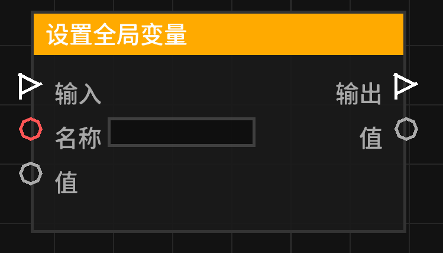

# 设置全局变量 (set_global_variable)

将指定的值存储到全局变量管理器中。全局变量跨蓝图上下文持久存在，适用于存储跨关卡或跨玩家的数据。

## 节点概览
- **分类**: 变量
- **内部ID**：`mgmc:set_global_variable`
- 

## 端口定义

### 执行流 (Exec)
| 端口名称 | 类型 | 说明 |
| :--- | :--- | :--- |
| **执行输入** (exec_in) | 执行流 (Exec) | 激活该节点。 |
| **执行输出** (exec_out) | 执行流 (Exec) | 节点完成全局赋值后，继续执行后续流程。 |

### 输入 (Inputs)
| 端口名称 | 类型 | 说明 |
| :--- | :--- | :--- |
| **名称** (name) | 字符串 (String) | 要设置的全局变量名称。 |
| **值** (value) | 任意 (Any) | 要存储的全局值。 |

### 输出 (Outputs)
| 端口名称 | 类型 | 说明 |
| :--- | :--- | :--- |
| **值** (value) | 任意 (Any) | 输出刚才设置的值，方便后续节点链式调用。 |

## 行为说明
1. **全局影响**：当执行流触发时，指定名称的变量将被存入全局管理器。这会影响所有访问该全局变量的蓝图。
2. **赋值逻辑**：节点会读取“名称”并去除首尾空格。如果名称有效且管理器可用，则执行存储。
3. **即时反馈**：输出端口实时反映输入端口的“值”，不依赖于执行流。
4. **覆盖行为**：如果全局管理器中已存在同名变量，旧值将被覆盖。
