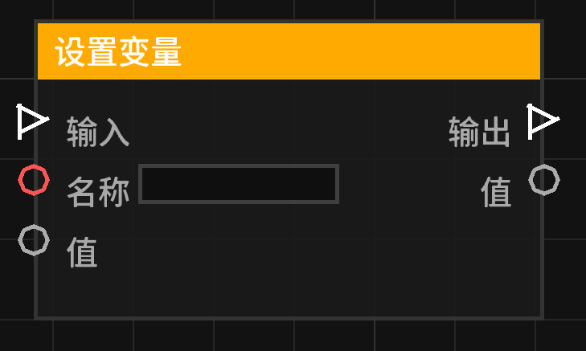

# 设置变量 (set_variable)

将指定的值存储到给定名称的变量中。

## 节点概览
- **分类**: 变量
- **内部ID**：`mgmc:set_variable`
- 

## 端口定义

### 执行流 (Exec)
| 端口名称 | 类型 | 说明 |
| :--- | :--- | :--- |
| **执行输入** (exec_in) | 执行流 (Exec) | 激活该节点。 |
| **执行输出** (exec_out) | 执行流 (Exec) | 节点完成赋值后，继续执行后续流程。 |

### 输入 (Inputs)
| 端口名称 | 类型 | 说明 |
| :--- | :--- | :--- |
| **名称** (name) | 字符串 (String) | 要设置的变量名称。 |
| **值** (value) | 任意 (Any) | 要存储的值。 |

### 输出 (Outputs)
| 端口名称 | 类型 | 说明 |
| :--- | :--- | :--- |
| **值** (value) | 任意 (Any) | 输出刚才设置的值，方便后续节点链式调用。 |

## 行为说明
1. **赋值逻辑**：当执行输入被激活时，节点会读取“名称”和“值”。如果名称不为空，则将值存入当前执行上下文的变量池中。
2. **持久性**：设置的变量仅在当前执行上下文中有效。
3. **输出转发**：输出端口会实时反映输入端口的“值”，无论节点是否被执行。
4. **覆盖行为**：如果指定的变量名称已存在，旧值将被新值覆盖。
