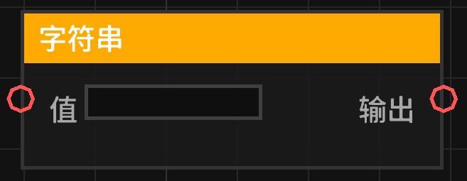

# 字符串 (string)

提供一个可配置的常数字符串文本。

## 节点概览
- **分类**: 变量 > 字符串
- **内部ID**：`mgmc:string`
- 

## 端口定义

### 输入 (Inputs)
| 端口名称 | 类型 | 说明 |
| :--- | :--- | :--- |
| **值** (value) | 字符串 (String) | 在编辑器中输入的文本内容。 |

### 输出 (Outputs)
| 端口名称 | 类型 | 说明 |
| :--- | :--- | :--- |
| **输出** (value) | 字符串 (String) | 输出输入的文本。 |

## 行为说明
1. **主要行为**：该节点主要用于在蓝图中提供一个固定的字符串常量。
2. **多行支持**：该节点在编辑器中支持多行文本输入（`multiline_text`）。
3. **默认值说明**：默认值为空字符串 `""`。
4. **即时运算**：该节点属于数据节点，其输出值始终等于输入端口设定的值。
