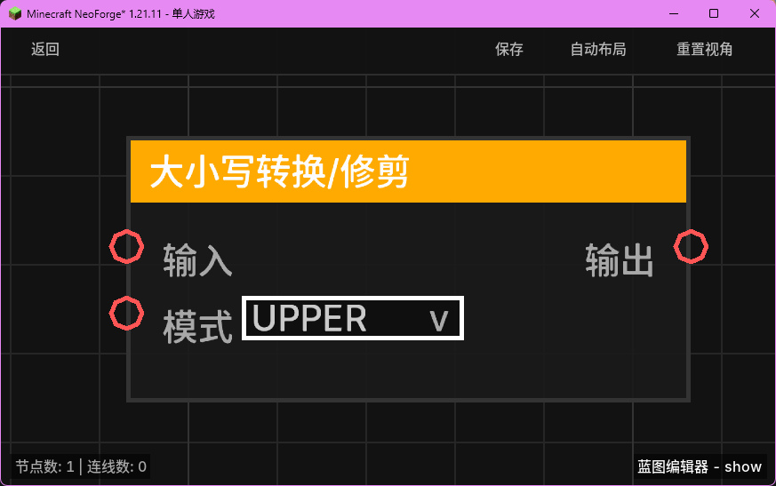

# 大小写转换/修剪 (String Case/Trim)

对输入的字符串进行大小写转换或去除首尾空格处理。

## 节点概览
- **分类**: 变量 > 字符串
- **内部ID**：`mgmc:string_case`
- 

## 端口定义

### 输入 (Inputs)
| 端口名称 | 类型 | 说明 |
| :--- | :--- | :--- |
| **输入** (Input) | 字符串 (String) | 需要处理的原始字符串。 |
| **模式** (Mode) | 字符串 (String) | 处理模式。支持：`UPPER` (转大写), `LOWER` (转小写), `TRIM` (修剪空格)。 |

### 输出 (Outputs)
| 端口名称 | 类型 | 说明 |
| :--- | :--- | :--- |
| **输出** (Output) | 字符串 (String) | 处理后的字符串。 |

## 行为说明
1. **模式处理**：根据“模式”端口的选择执行相应的字符串操作：
    - `UPPER`：将所有字符转换为大写。
    - `LOWER`：将所有字符转换为小写。
    - `TRIM`：去除字符串首尾的所有空白字符（如空格、换行符等）。
2. **默认行为**：如果“模式”端口未指定或输入了未知值，默认执行 `UPPER` (转大写) 操作。
3. **空值处理**：如果原始“输入”字符串为 `null`，节点将返回一个空字符串 `""`。
4. **类型转换**：输入端口会自动将非字符串类型转换为字符串后再进行处理。
