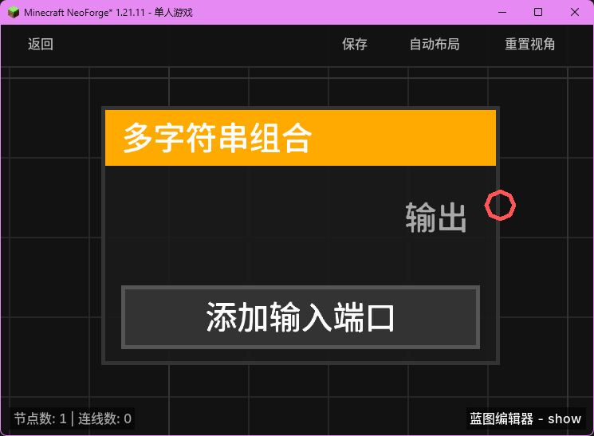

# 多字符串组合 (String Combine)

**多字符串组合** 节点用于将多个字符串按顺序连接在一起。与基础的拼接节点不同，该节点支持动态增加输入端口。

## 节点概览
- **分类**: 变量 > 字符串
- **内部ID**：`mgmc:string_combine`
- 

## 端口定义

### 输入 (Inputs)
- **动态端口**：初始状态没有输入端口，用户可以通过节点上的按钮动态添加。
- **添加按钮**：点击“添加输入端口”按钮会新增一个字符串输入端口。

### 输出 (Outputs)
| 端口名称 | 类型 | 说明 |
| :--- | :--- | :--- |
| **输出** (Output) | 字符串 (String) | 所有输入端口内容按顺序拼接后的结果。 |

## 行为说明
1. **动态输入**：该节点支持 `dynamic_inputs` 特性。用户可以在编辑器中根据需要添加任意数量的输入端口。
2. **顺序拼接**：节点会解析所有输入端口的 ID，并按照 ID 中的数字顺序进行排序，确保拼接结果的顺序与 UI 上显示的顺序一致。
3. **自动转换与合并**：
   - 内部使用 `StringBuilder` 进行高效拼接。
   - 每个输入都会通过 `TypeConverter.toString` 自动转换为字符串。
   - 如果某个端口未连接或值为 `null`，该项将被忽略（不占位）。
4. **用途**：适用于需要将大量变量连接成一段长文本的场景，避免了嵌套多个“字符串拼接 (A+B)”节点的繁琐。
