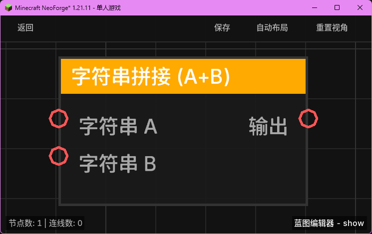

# 字符串拼接 (A+B) (String Concat)

**字符串拼接 (A+B)** 节点用于将两个字符串合并为一个完整的字符串。

## 节点概览
- **分类**: 变量 > 字符串
- **内部ID**：`mgmc:string_concat`
- 

## 端口定义

### 输入 (Inputs)
| 端口名称 | 类型 | 说明 |
| :--- | :--- | :--- |
| **字符串 A** (String A) | 字符串 (String) | 第一个待拼接的字符串。 |
| **字符串 B** (String B) | 字符串 (String) | 第二个待拼接的字符串。 |

### 输出 (Outputs)
| 端口名称 | 类型 | 说明 |
| :--- | :--- | :--- |
| **输出** (Output) | 字符串 (String) | 拼接后的结果字符串（A + B）。 |

## 行为说明
1. **内容合并**：节点会将 `字符串 A` 的末尾与 `字符串 B` 的开头直接连接。
2. **自动类型转换**：即便输入端口接收的是其他类型（如数字或实体名称），节点内部会通过 `TypeConverter.toString` 自动将其转换为字符串格式再进行拼接。
3. **空值处理**：如果任意一个输入为 `null`，它将被视为空字符串 `""` 处理，确保拼接操作始终能成功返回结果。
4. **用途**：常用于构建复杂的显示文本、指令字符串或动态提示消息。
