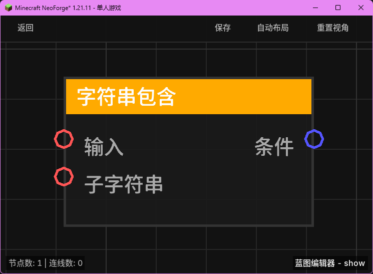

# 字符串包含 (String Contains)

**字符串包含** 节点用于检查主字符串中是否包含指定的子字符串。

## 节点概览
- **分类**: 变量 > 字符串
- **内部ID**：`mgmc:string_contains`
- 

## 端口定义

### 输入 (Inputs)
| 端口名称 | 类型 | 说明 |
| :--- | :--- | :--- |
| **输入** (Input) | 字符串 (String) | 要进行搜索的主字符串。 |
| **子字符串** (Substring) | 字符串 (String) | 要在主字符串中查找的内容。 |

### 输出 (Outputs)
| 端口名称 | 类型 | 说明 |
| :--- | :--- | :--- |
| **条件** (Condition) | 布尔值 (Boolean) | 如果主字符串中包含子字符串，则返回 `true`；否则返回 `false`。 |

## 行为说明
1. **包含检测**：节点会检查 `输入` 字符串中是否存在完全匹配 `子字符串` 的内容。
2. **区分大小写**：该检测是区分大小写的。例如，"Hello" 不包含 "hello"。
3. **自动转换**：输入端口会自动将非字符串类型（如数字、UUID）转换为字符串后再进行比较。
4. **空值处理**：如果主字符串或子字符串为 `null`，节点将返回 `false`。
5. **用途**：常用于检测玩家聊天消息中的关键词、判断实体名称是否符合特定前缀或后缀规则等。
