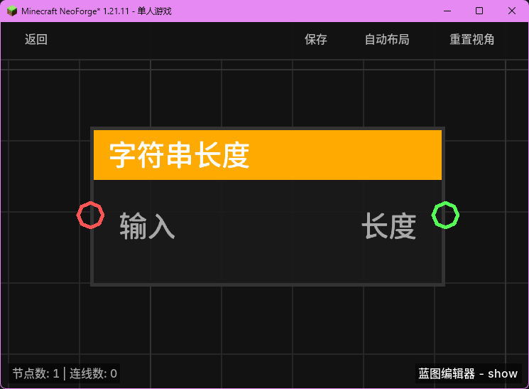

# 字符串长度 (String Length)

**字符串长度** 节点用于计算指定字符串中的字符总数。

## 节点概览
- **分类**: 变量 > 字符串
- **内部ID**：`mgmc:string_length`
- 

## 端口定义

### 输入 (Inputs)
| 端口名称 | 类型 | 说明 |
| :--- | :--- | :--- |
| **输入** (Input) | 字符串 (String) | 要计算长度的目标字符串。 |

### 输出 (Outputs)
| 端口名称 | 类型 | 说明 |
| :--- | :--- | :--- |
| **长度** (Length) | 浮点数 (Float) | 字符串中字符的数量。 |

## 行为说明
1. **字符计数**：节点返回字符串中包含的字符总数（包括空格和特殊符号）。
2. **自动类型转换**：如果输入端口接收的是非字符串类型（如数字或实体对象），节点会先通过 `TypeConverter.toString` 将其转换为字符串格式，然后计算其文本长度。
3. **空值处理**：如果输入为 `null`，节点将返回 `0.0`。
4. **用途**：常用于验证玩家输入长度、根据文本内容动态调整 UI 显示或执行截断逻辑。
