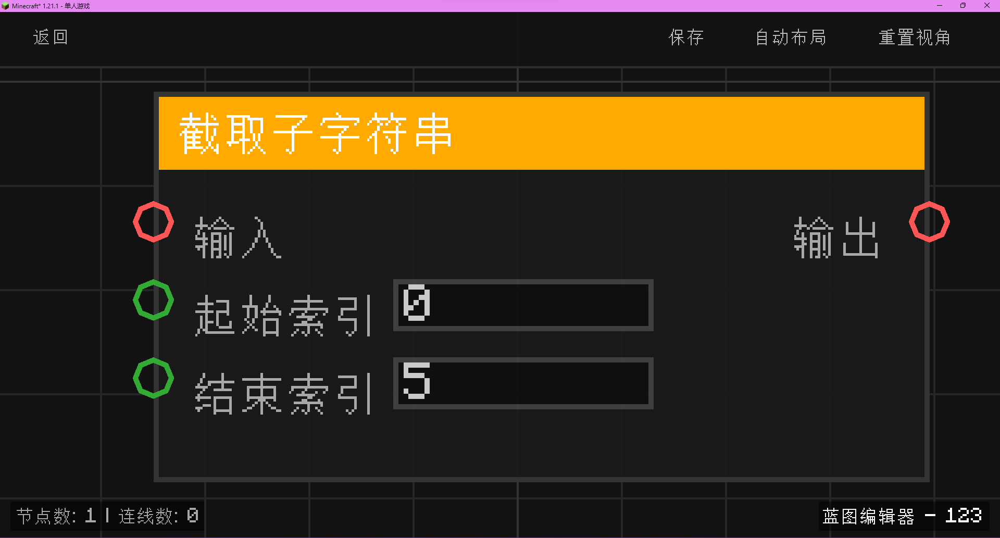

# 截取子字符串 (Substring)

从输入的字符串中截取指定范围的字符片段。

## 节点概览
- **分类**: 变量 > 字符串
- **内部ID**：`mgmc:string_substring`
- 

## 端口定义

### 输入 (Inputs)
| 端口名称 | 类型 | 说明 |
| :--- | :--- | :--- |
| **输入** (Input) | 字符串 (String) | 原始字符串。 |
| **起始索引** (Start) | 整数 (Int) | 截取的起始位置（包含）。从 0 开始计数。 |
| **结束索引** (End) | 整数 (Int) | 截取的结束位置（不包含）。 |

### 输出 (Outputs)
| 端口名称 | 类型 | 说明 |
| :--- | :--- | :--- |
| **输出** (Output) | 字符串 (String) | 截取得到的子字符串。 |

## 行为说明
1. **范围截取**：该节点根据提供的索引范围从原始字符串中提取字符。符合 Java 标准的 `substring(start, end)` 行为。
2. **索引安全检查**：
    - 起始索引会自动限制在 `[0, 字符串长度]` 范围内。
    - 结束索引会自动限制在 `[起始索引, 字符串长度]` 范围内。
    - 这意味着即使输入了越界的索引，节点也不会报错，而是返回最接近的有效片段。
3. **空值处理**：如果原始输入字符串为 `null`，节点将返回一个空字符串 `""`。
4. **即时运算**：该节点属于数据节点，不包含执行流（Exec）。每当其输出端口被引用时，都会根据当前的输入字符串和索引重新截取子串。
