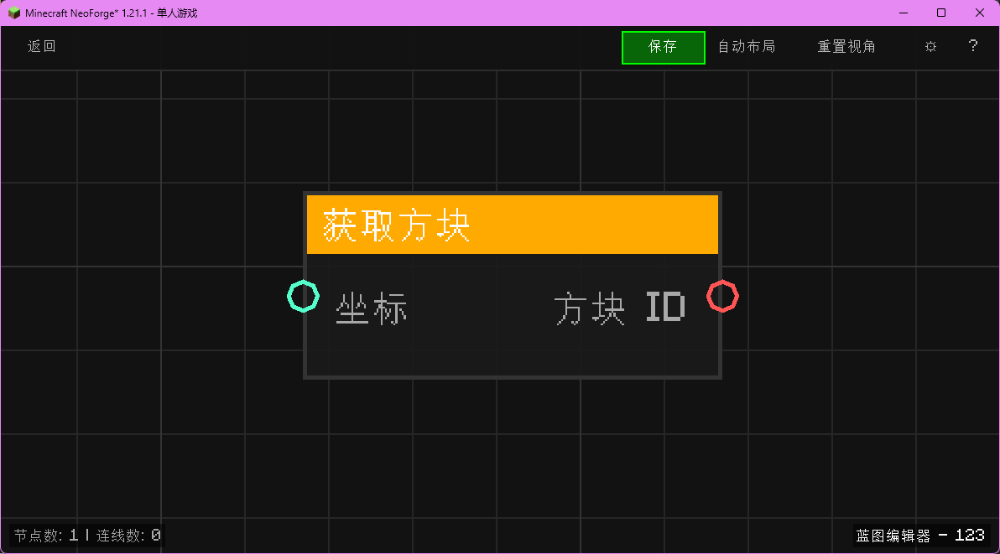

# 获取方块 (Get Block)

获取指定坐标处的方块 ID。

## 节点概览
- **分类**: 变量 > 世界
- **内部ID**：`mgmc:get_block`
- 

## 端口定义

### 输入 (Inputs)
| 端口名称 | 类型 | 说明 |
| :--- | :--- | :--- |
| **坐标** (XYZ) | 坐标 (XYZ) | 要获取方块的坐标位置。 |

### 输出 (Outputs)
| 端口名称 | 类型 | 说明 |
| :--- | :--- | :--- |
| **方块 ID** (Block ID) | 字符串 (String) | 该位置的方块注册名（例如 `minecraft:stone`）。 |

## 行为说明
1. **主要行为**：读取输入坐标处的方块状态，并返回其资源定位符（Resource Location）字符串。
2. **特殊情况**：如果坐标无效或区块未加载，可能返回 `minecraft:air`。
