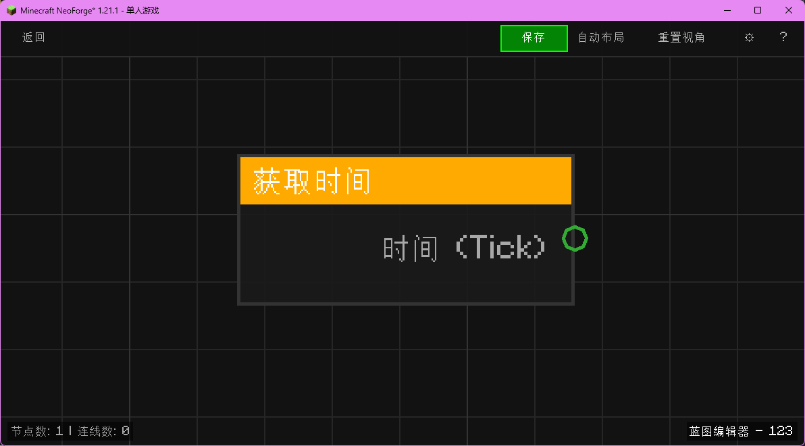

# 获取时间 (Get Time)

获取当前世界时间（Ticks）。

## 节点概览
- **分类**: 变量 > 世界
- **内部ID**：`mgmc:get_time`
- 

## 端口定义

### 输出 (Outputs)
| 端口名称 | 类型 | 说明 |
| :--- | :--- | :--- |
| **时间 (Tick)** (Time) | 整数 (Integer) | 当前世界的总时间（DayTime）。 |

## 行为说明
1. **主要行为**：返回当前世界的时间。0-24000 循环。
