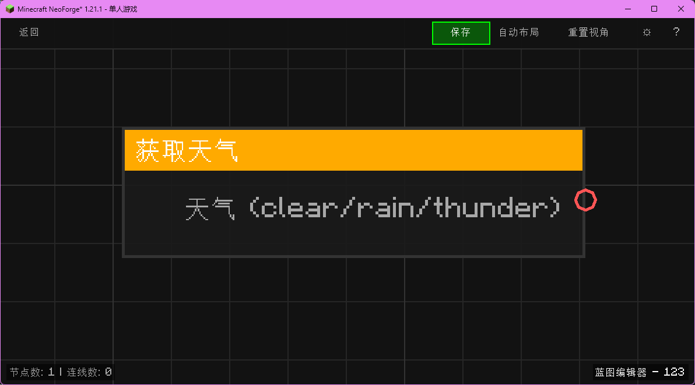

# 获取天气 (Get Weather)

获取当前世界的天气状态。

## 节点概览
- **分类**: 变量 > 世界
- **内部ID**：`mgmc:get_weather`
- 

## 端口定义

### 输出 (Outputs)
| 端口名称 | 类型 | 说明 |
| :--- | :--- | :--- |
| **天气** (Weather) | 字符串 (String) | 返回 "clear"（晴朗）、"rain"（下雨）或 "thunder"（雷暴）。 |

## 行为说明
1. **主要行为**：检查当前世界的降雨和雷暴状态。
2. **返回值**：
   - 优先判断雷暴，返回 `thunder`。
   - 其次判断降雨，返回 `rain`。
   - 否则返回 `clear`。
