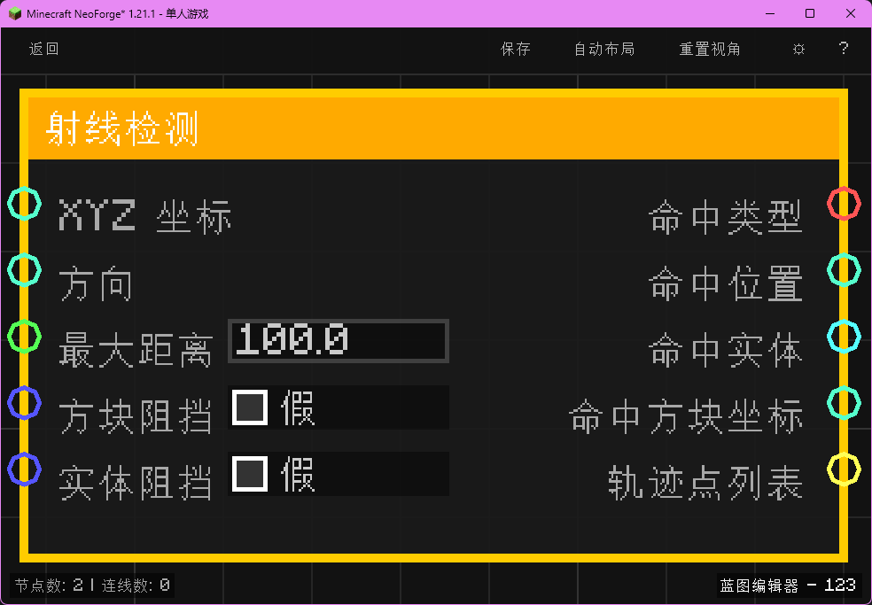

# 射线检测 (Raycast)
向指定方向发射一条射线，检测是否碰撞到方块或实体。

## 节点概览
- **分类**：变量 > 世界
- **内部ID**：`mgmc:raycast`
- **预览图**：
  

## 端口定义表格

### 输入 (Inputs)
| 端口名称 | 类型 | 说明 |
| :--- | :--- | :--- |
| **XYZ 坐标** (XYZ Position) | XYZ | 射线发射起点。默认为 (0,0,0)。 |
| **方向** (Direction) | XYZ | 射线发射方向向量。会自动归一化。默认 (0,1,0)。 |
| **最大距离** (Max Distance) | 浮点数 (Float) | 射线最大检测距离。默认 100.0。 |
| **方块阻挡** (Stop on Block) | 布尔值 (Boolean) | 是否被方块阻挡。如果为 False，射线将穿透方块（忽略方块碰撞）。默认 True。 |
| **实体阻挡** (Stop on Entity) | 布尔值 (Boolean) | 是否被实体阻挡。如果为 False，射线将穿透实体（忽略实体碰撞）。默认 True。 |

### 输出 (Outputs)
| 端口名称 | 类型 | 说明 |
| :--- | :--- | :--- |
| **命中类型** (Hit Type) | 字符串 (String) | 命中结果类型。可能的值："MISS" (未命中), "BLOCK" (方块), "ENTITY" (实体)。 |
| **命中位置** (Hit Position) | XYZ | 射线碰撞点的精确坐标。如果未命中，则为射线终点。 |
| **命中实体** (Hit Entity) | 实体 (Entity) | 如果命中实体，返回该实体对象。否则为 Null。 |
| **命中方块坐标** (Hit Block Pos) | XYZ | 如果命中方块，返回该方块的整数坐标。否则为 (0,0,0)。 |
| **轨迹点列表** (Ray Points) | 列表 (List) | 包含射线上从起点到终点的一系列坐标点（间隔 0.5 格）。可用于粒子效果渲染或调试可视化。 |

## 行为说明
1. 节点根据输入的 **起点** 和 **方向** 发射射线。
2. 射线长度由 **最大距离** 决定。
3. 如果 **方块阻挡** 为 True，射线遇到碰撞箱的方块会停止。
4. 如果 **实体阻挡** 为 True，射线遇到可交互实体（非旁观者）会停止。
5. 系统会计算方块和实体中最近的碰撞点作为最终结果。
6. **轨迹点列表** 输出包含路径上的采样点，方便用户使用 "遍历列表" 和 "播放粒子" 节点来可视化射线路径。
