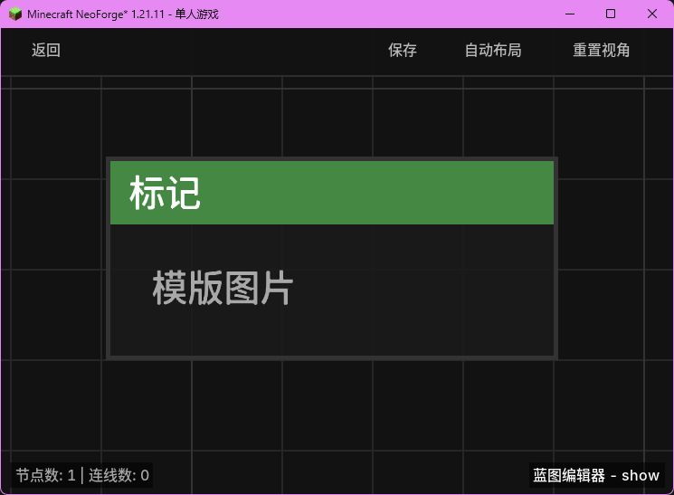

# 节点名称 (Internal Name)

一句话描述该节点的核心功能。

## 节点概览
- **分类**: 父分类 > 子分类
- **内部ID**：`mgmc:node_id`
- 

## 端口定义

### 输入 (Inputs)
| 端口名称 | 类型 | 说明 |
| :--- | :--- | :--- |
| **端口名** (Internal) | 类型名 | 端口描述。 |

### 输出 (Outputs)
| 端口名称 | 类型 | 说明 |
| :--- | :--- | :--- |
| **端口名** (Internal) | 类型名 | 端口描述。 |

## 行为说明
1. **主要行为**：描述节点被触发或调用时的核心逻辑。
2. **特殊情况**：描述边界情况（如空值、非法输入）的处理。
3. **注意事项**：描述与其他节点的配合或潜在的影响。
