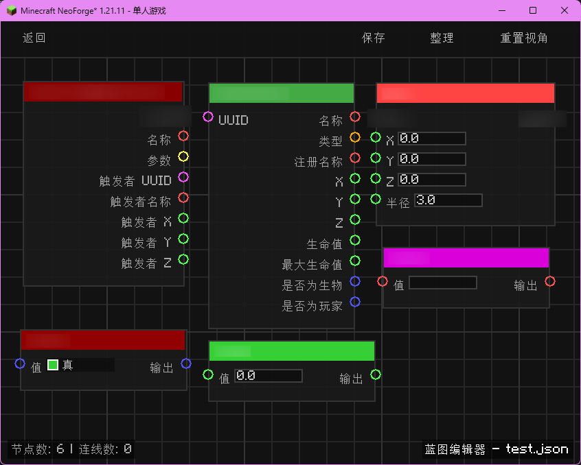
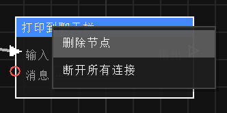

### 1. 蓝图 (Blueprint)
蓝图是逻辑的载体，以 `.json` 文件形式存储在你的游戏存档目录。

### 2. 节点 (Node)
节点是逻辑的最小单元。
- **事件节点 (Events)**: 逻辑的起点（如：当玩家移动、当输入命令时）。
- **动作节点 (Actions)**: 执行具体操作（如：在聊天框打印、产生爆炸、播放粒子）。
- **逻辑节点 (Logic)**: 处理数据（如：分支判断、数学运算、类型转换）。

### 3. 端口 (Port)
- **执行端口 (Exec)**: 白色箭头，决定逻辑运行的顺序。

- **数据端口 (Data)**: 任何颜色的圆，用于在节点间传递信息（如数字、字符串、坐标）。

## 基本操作

- **打开编辑器**: 在游戏中按下 `Ctrl + M` 键。（注意：仅在 **创造模式** 下可用）

- **新增蓝图**: 在顶部输入框输入蓝图名称，点击 `创建` 按钮。

- **添加节点**: 在编辑器空白处**右键点击**弹出菜单。

- **连接节点**: 点击并拖拽一个节点的输出端口到另一个节点的输入端口。

- **删除内容**: 选中节点或连线后，按下 `Delete` 键或点击右键选择 **“删除节点”**。

- **保存蓝图**: 点击顶部栏的 `保存` 按钮。

