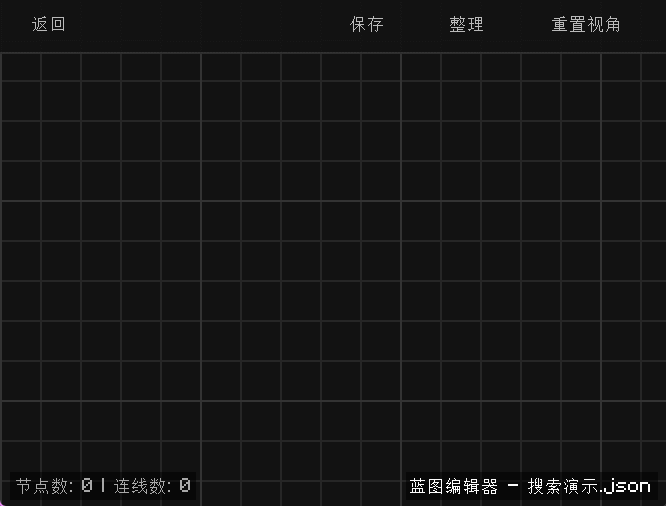
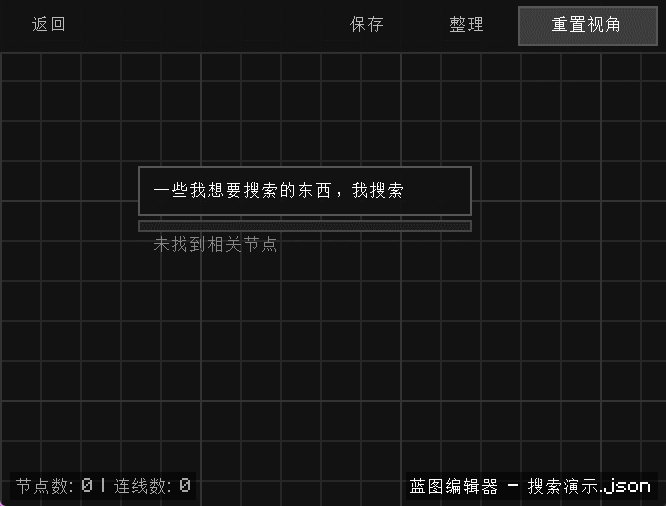
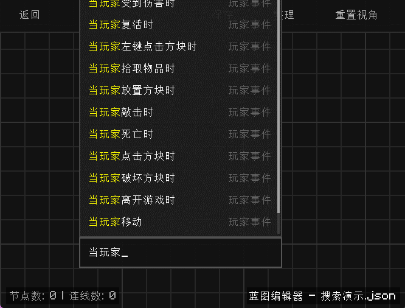
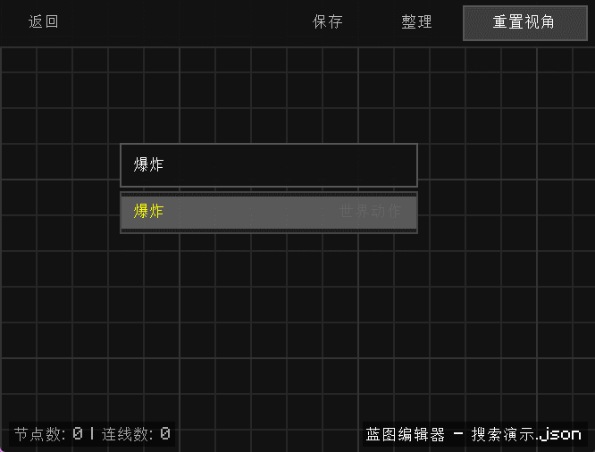
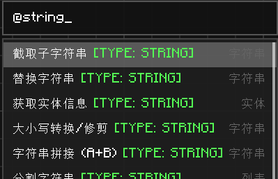
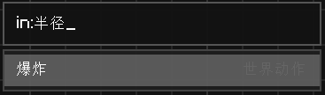
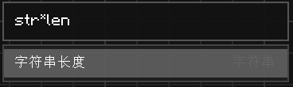
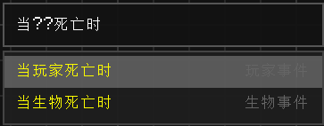
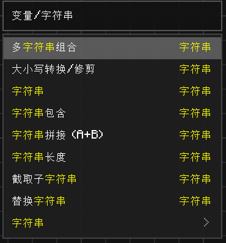

# 搜索 (Search)

在蓝图编辑器中，右键点击空白处即可打开搜索菜单。该搜索功能不仅支持模糊匹配，还内置了高效的过滤语法。

## 基础搜索

- **多词匹配**：使用空格分隔多个关键词（如 `set var`），搜索结果将仅显示同时包含这些词的节点。

- 搜索结果的第一项会自动高亮，按下 `Enter` 键可立即在当前位置创建该节点。

- **键盘导航**：
  - `Backspace`：删除搜索词。
  
  - `↑ / ↓`：在结果列表中切换选择。
  
  - `Enter`：创建当前选中的节点。
  
- **鼠标依然可用**：在搜索结果中，你可以通过滚轮来滚动查看更多结果,并使用鼠标点击来选择节点。

## 高级过滤语法

你可以使用特定的前缀来针对节点的引脚（端口）或类型进行精准搜索：

### 1. 端口标签搜索
- **`@名称`**：搜索所有引脚。
  - 示例：`@string` 会列出所有带有字符串引脚的节点。
  
- **`in:名称`**：仅搜索输入引脚。
  - 示例：`in:半径` 会列出所有名为“半径”的引脚。
  
- **`out:名称`**：仅搜索输出引脚。
  - 示例：`out:exec` 会列出所有带执行输出的节点。
  

### 2. 通配符搜索
支持简单的正则表达式符号：
- `*`：匹配任意数量的字符。例如 `str*len` 可定位到“获取字符串长度”。

- `?`：匹配单个字符。

### 3. 分类导航搜索
使用 `/` 符号来定位特定分类下的节点：
- `list/`：列出“列表”分类下的所有节点。

- `变量/字符串`：在“变量/字符串”分类下搜索节点。

## 搜索算法逻辑

搜索系统基于权重评分系统对结果进行排序：
- **全词匹配**：权重最高，排在首位。
- **前缀匹配**：权重次之。
- **路径匹配**：匹配节点所在的分类路径。
- **引脚匹配**：如果你使用了过滤标签（如 `in:`），匹配引脚的节点将获得额外加分。
